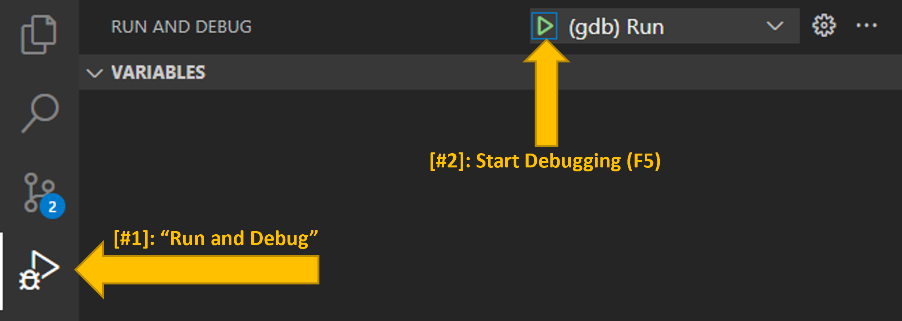
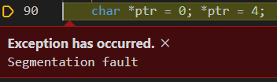
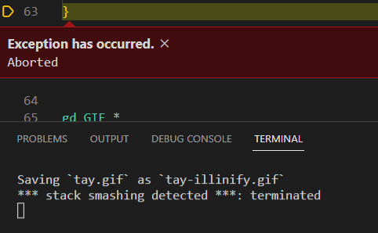
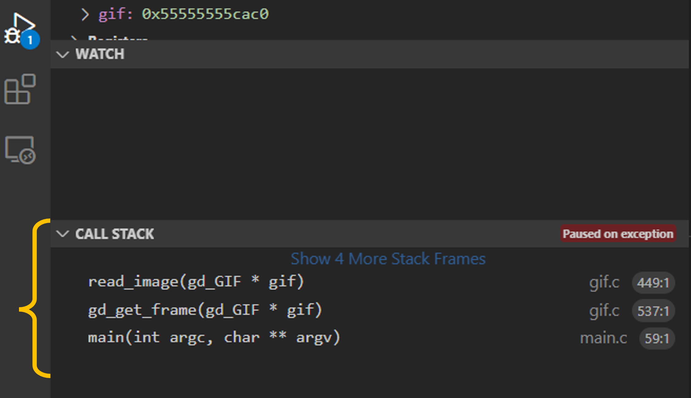
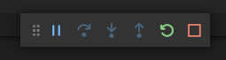
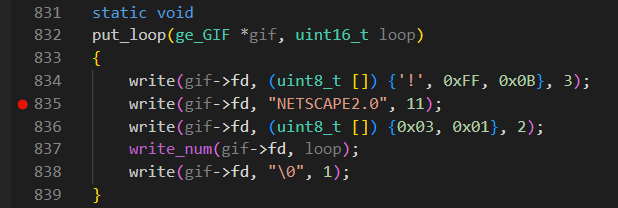

# Overview

At this point in your journey as a programmer, I know you are an amazing programmer and have mastered developing small programs! 🎉 In CS 340, you will explore how systems interact with each other and how to build software as part of a larger ecosystem of code.

It is critically important that you have the development environment to support debugging and developing code.  In this MP, you will:

- Set up your development and debugging environment for programming MPs in CS 340,
- Interact with open-source C code for encoding and decoding a GIF image,
- Learn how to do interactive debugging by fixing several bugs I made while trying to Illinify a GIF of Taylor,
- Use the CS 340 GitHub for code submission and autograding

MP0 is a **preparation MP of the course and is orders of magnitude easier than every other MP in this course**.  Don't set your expectations based on this MP.  Seriously. :)


## Part 1: Initial Setup

Before programming, you'll need to set up your programming environment and git repository.

1. Follow our guide: ["Programming Environment Setup for CS 340"](https://systems-encyclopedia.cs.illinois.edu//articles/illinois/system/)

2. Once you have a `cs340` directory, follow our guide: ["Setting Up git for CS 340"](https://systems-encyclopedia.cs.illinois.edu//articles/illinois/git/)


## Part 2: Fetching the MP0 Starting Code

We have some initial code for your `mp0` for you to get started.  Use the following command in your `cs340/netid` directory to `merge` our initial `mp0` directory into your local repository:

```
git fetch release
git merge release/mp0 --allow-unrelated-histories -m "Merging release repository"
```


## Part 3: Becoming Familiar with Visual Studio Code

Throughout this MP, you will use several features of Visual Studio Code to get comfortable with it!

- **Opening a Project Folder**: Most of Visual Studio Code's project-related features are based on the root of the current folder you have open within Visual Studio Code. Make sure to **open the `mp0` folder** in Visual Studio Code.  *(You cannot open your `cs340` directory, or your `netid` directory, it must be your `mp0` directory.)*

    - From a terminal, you can run `code .` to open up VS Code from that folder.

    - Inside of VS Code, you can use File -> Open Folder to open a new folder.


- **Opening the Integrated Terminal**: The keyboard shortcut `Ctrl + ~` will open/close the integrated terminal inside of Visual Studio Code.  Using the integrated terminal, let's verify you are all set up for running C programs by doing the following:

    - On your terminal, run `make` to compile the provided code.
    - If you receive any errors, read the error messages.  They will often be helpful to describe what's going wrong.  If you're stuck here, reach out to get help!


- **Running a Visual Debugger**: As part of the provided code, we have provided `.vscode/launch.json`.  This configuration file is used by Visual Studio Code to understand the steps needed to "run" your project.  It will compile your code using `make` and then run `./main` inside of a debugger connected to VS Code.  Use Visual Studio Code to "run" your project:

    - On the left side of Visual Studio Code, find the "Run and Debug" Interface (#1).
    - Once on the "Run and Debug" interface, find the green "Debug" arrow to start your program with a visual debugger (#2).

    

    - Press `<Enter>` to accept `tay.gif` as the input file.  You'll use your own gif later.
    - If the launch of the visual debugger was successful, you will see the program execution pause at the exact moment when the segmentation fault occurred.  *This may be one of the few times you will ever **want** a segmentation fault to show up!*

    


## Part 4: Debugging the Code

The purpose of this MP is to get comfortable with Visual Studio Code and viewing C code.  The `gif.c` file provided is based off of Marcel Rodrigues' ultra-small GIF encoding and decoding library, but then modified to allow us to "Illinify" any GIF animation.

Unfortunately, there are several bugs in the code that prevent it from running.  You will need to use the Visual Studio Code debugger to help find the bugs.

- Every bug we introduced **except for one** can be fixed by commenting out a single line of `gif.c` to resolve the bug.
- The remaining bug **requires you make one change to an existing line of code**.

To solve these bugs, you will need to follow some common debugging patterns.


### Common Debugging Pattern #1: Segmentation Faults

When you run the provided code, you will immediately have a segmentation fault.  When using an interactive debugger, you will see the **exact position in code** when the segmentation fault **occurs**.

A segmentation fault is an access to a memory address that is not allocated to your process.  Often, the line of code where the segmentation fault occurs is valid code. You may need to inspect the code executed in the lines prior to the segmentation fault.

Other errors in the code, like infinite recursion, can cause a segmentation fault when the process runs out of available memory allocated to the process to add a new stack frame.

You will fix several segmentation faults throughout `mp0`.


### Common Debugging Pattern #2: Terminal Messages on Abort

A segmentation fault is only one type of exception that can occur in your code.  Other exceptions will provide additional information in `stdout` or `stderr` reported on your integrated VS Code terminal.

In this bug you will find that the debugger reports `*** stack smashing detected ***`:



Stack smashing occurs when you write onto stack frame of a function, which is the memory immediately following the local variables to the function.  Check the code to find out where we might have written a few too many bytes. *(This is the one and only place in `mp0` where you don't comment a line to fix a bug, but modify it.)*

You will find additional output in the terminal when finding other bugs throughout `mp0`.

<div class="alert alert-info">

<h4>macOS Specific Information</h4>

The default debugger on macOS, <code>lldb</code>, was not able to give a useable stack trace on this stack smashing bug.  To fix this bug, figure out the error on Line 61 -- where <code>read</code> is called inside of the <code>read_num</code> function.

</div>


### Common Debugging Pattern #3: Examining the Call Stack

When your program is paused (due to an exception, you pressing pause, a breakpoint you set, or any other reason), the "Run and Debug" window shows a wealth of useful debugging information.

One panel is labeled "Call Stack". It will list the function calls that were called leading to where your program is currently paused.  You can **click on them** to jump to their location in code.



In a call stack, the top is the most recent function called.  Specifically, the above call stack shows the `read_image` function located in `gif.c` was called and the current line being executed is Line `449`.  This function was invoked by the function below (`gd_get_frame`), which itself was invoked by the function below that (`main`), which is the starting point of this execution.

The call stack is very useful for finding **infinite recursion** if you see the same function name again and again and again.  You will want to reference the call stack for several bugs in `mp0`.


### Common Debugging Pattern #4: Using Pause and Code Stepping

A common programming error is in accidental infinite loop, where no exception occurs but your program is stuck.  A common debugging pattern is to pause the execution and examine the code where your program is stuck.

When Visual Studio Code is running your code, you will see the control window:



Pressing the left-most "Pause" button will pause the execution of the program and provide you information about the current point of execution.  When the program is paused:

- You can **hover over variables** to see the values their hold,
- You can **view the call stack** and other debugging information,
- You can **use the control window** to step through your code line-by-line,
- ...and more!


### Common Debugging Pattern #5: Setting Breakpoints

Instead of pausing the program manually, programmers will **set a breakpoint** to have the program automatically pause immediately before running the line of code where the breakpoint is set.

To set a breakpoint, **click on the space immediately to the left of the line number**.  A bright red dot will appear to indicate that an active breakpoint is set:



In the example above, execution will pause after running Line 834 but before running Line 835.  Since it's paused, you can inspect all of the variables at the exact moment before running Line 835.  If you resume the program and the breakpoint is encountered again, it will pause again.


## Part 5: Discovering a Hidden Message

Once you have all the bugs debugged, the program will complete and process all of the GIF frames and produce `tay-illinify.png` -- you have just done an Illinify transformation of a Taylor Swift GIF!

<div class="row text-center mb-3">
<div class="col-6">
  
  <div>Original <code>tay.gif</code></div>
</div>
<div class="col-6">
  
  <div><code>tay-illinify.gif</code></div>
</div>
</div>

Nope.

That's not enough Illini. 

Did it even work?


### Final Fix: A Hidden Message

As your final debugging task, I **hid a message for you in the source code**.  Use your knowledge of Visual Studio Code debugging, find the value stored inside of the global variable `message` **at any time after** the `_illinify` function is called.  *(Hint: Set a breakpoint; I purposefully made sure the message would not show up if you just use `printf`.)*

Follow the instructions stored in the variable `message` I hid for you, run the program, and check out how `tay-illinify.gif` looks now!


## Part 6: Course Discord

The primary CS 340 virtual space is the CS 340 Discord server.  I want to see your favorite GIF, and make sure you're all set up with Discord so you can be part of the CS 340 community.

- If you have not already, join the CS 340 Discord.  Change your nickname on the CS 340 server to something where we know who you are on Discord (either your first name, your NetID, something) **or** DM `waf` to privately share your username/identity association so we can give you points.
- Illinify a GIF of something special to you (yourself, a celebrity, Genshin Impact, whatever).
- Post your transformed GIF to the `#mp0-gifs` Discord channel.


## Submission and Grading

### Testing Suite

When you are finished working on the MP, you can run a **local copy of the same test suite that you will use for grading**.  To run the test suite:

- To compile the test suite, run `make test`.
- To run your code, run `./test` and everything should pass! 🎉


### Submission

Once you have locally passed all the tests, you will need to submit and grade your code.  First commit using the standard git commands:

```
git add -A
git commit -m "MP submission"
git push
```


### Grading

The initial grading is done via a manual GitHub Action.  You **MUST** complete this step before the deadline to earn any points for the MP:

- Navigate to your repository on [https://github.com/cs340-illinois](https://github.com/cs340-illinois).
- Click on the "Action" Tab
- Choose "mp0 autograding"
- Click the green "Run Workflow" button (located on the blue bar)
- Press "Run Workflow"
- You will trigger a GitHub Action that will complete the grading run!


### Points

The 40 points for this MP are split in the following way:

| Description | Points |
| ----------- | ------ |
| Test Suite  |     30 |
| Discord     |     10 |
